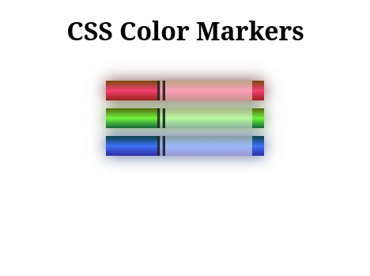

# fcc-color-markers
# CSS Color Markers 🎨

FCC Workshop complete. RGB + HSL + Hex + Linear Gradients + Box-Shadow.

**Use case:** Design system for SOC dashboards. Critical/Warning/Safe/Info states.
**Stack:** CSS3 | Day 12 #100DaysOfCode
**Live:**  https://cedricboucard.github.io/fcc-color-markers/

# Screenshot

